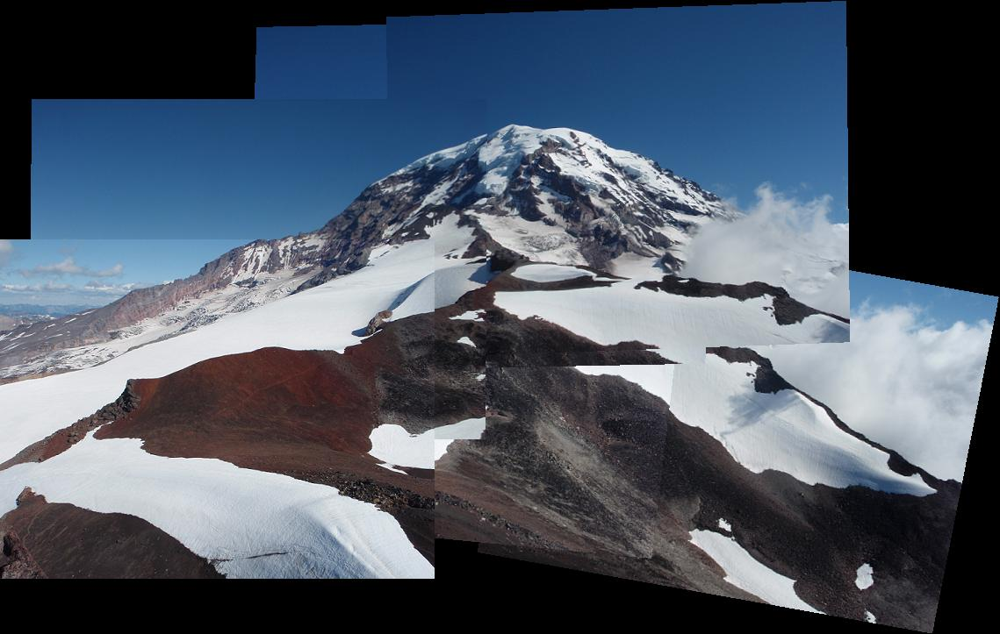
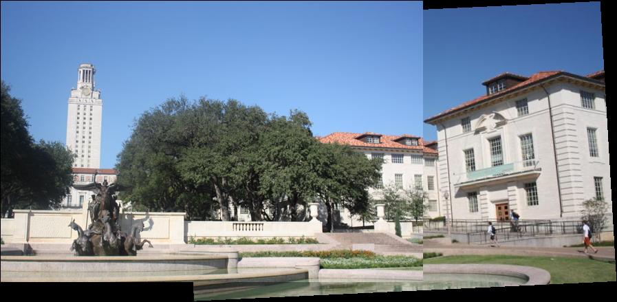

# JackChen <span style="color:red">(104061563)</span>

# Project 2 / Panorama Stitching

## Overview
The project is related to 
> Panorama Stitching

interesting lab :)
## Implementation
1. Match SIFT Descriptors function
	* repeat each row of descriptor1 by function repmat
```
    input_mat1=repmat(input_rowd1,length(descriptor2(:,1)),1);
```
	* compute difference matrix and calculate euclidean distance
```
	diff_mat=input_mat1-descriptor2;
	diff_mat=diff_mat.^2;
    y=sqrt(sum(diff_mat,2));
    ```
   * find the min and second min value of euclidean distance. add match point if min value < second min value * threshold
    ```
	second_minval=sorty(2);        
    [min_value min_index]=min(y);
    if min_value<second_minval*thresh;
        match=[match;[i,min_index]];
    else
        continue;
    end
    ```
    
2. Fit the Transformation Matrix
	* To solve the least square problem which is stated: Ax=b, use Matlab function "\" then x=A\b 

```
H=P1'\P2';
H=H';% to switch H back
```
3. RANSAC
	* Randomely sample the points in the candidate points, calculate the Affine matirx, distance between the estimated points and the matched points in the second image set, and then let all of the points vote for the Affine matrix. 

here I only show how to complete the compute error funciton
```
dists = zeros(size(match,1),1);
    pt1_match=pt1(match(:,1),:);
    pt1_match=[pt1_match ones(length(pt1_match(:,1)),1)]';% extend matrix to [p1_x p1_y 1]
    pt2_match=pt2(match(:,2),:);
    pt2_match=[pt2_match ones(length(pt2_match(:,1)),1)]';% extend matrix to [p2_x p2_y 1]
    diff_pt=H*pt1_match-pt2_match; the form of pt from [x1 x2] to [x1 x2 1]
    dists=sqrt(sum(diff_pt.^2,1))';
    ```
    
4. Stitching ordered sequence of images
	* Put the candidate images in order, calculate the transform matrixs between them (one over another).
	* Choose a reference matrix and calculate the transform matrix and calculate the transform matrixs of any other images with respect to the rederence matrix

here I only show how to complete the transformation function which calculate the transform matrixs between each matrix and reference matrixs using the i_to_i+1 transformation matrix array
```
T=eye(length(i_To_iPlusOne_Transform{refFrameIndex}));
if refFrameIndex> currentFrameIndex % case one
    for i=currentFrameIndex:1:refFrameIndex-1
        T=i_To_iPlusOne_Transform{i}*T;
    end
else
    for i=currentFrameIndex-1:-1:refFrameIndex %case two
        T=pinv(i_To_iPlusOne_Transform{i})*T;
    end
end
```


## Installation
* [VLFeat](http://www.vlfeat.org/download.html)
* 1. Click above link
* 2. Click [VLFeat 0.9.20 binary package](http://www.vlfeat.org/download/vlfeat-0.9.20-bin.tar.gz) and download
* 3. Extract the package you will see folder :vlfeat-0.9.20
* 4. Then step in the folder vlfeat-0.9.20 -> toolbox -> run vl_setup.m in matlab
* 5. The vl_setup.m adds all the path to execute VLFeat package.

### Results

<table border=1>
<tr>
<td>



</td>
</tr>


Our daily photo in my lab :)


</table>
